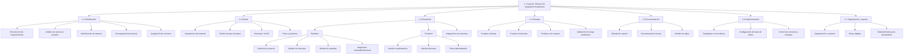

## 📊 Estructura Desglosada del Trabajo (EDT)

```mermaid
graph TD
    A[1. Proyecto: Sistema de Asignación Académica]

    A --> A1[1.1 Planificación]
    A1 --> A1a[Recolección de requerimientos]
    A1 --> A1b[Análisis de procesos actuales]
    A1 --> A1c[Identificación de actores]
    A1 --> A1d[Cronograma del proyecto]
    A1 --> A1e[Asignación de recursos]

    A --> A2[1.2 Diseño]
    A2 --> A2a[Arquitectura del sistema]
    A2 --> A2b[Diseño de base de datos]
    A2 --> A2c[Mockups / UI/UX]
    A2 --> A2d[Roles y permisos]

    A --> A3[1.3 Desarrollo]
    A3 --> A3a[Backend]
    A3a --> A3a1[Gestión de usuarios]
    A3a --> A3a2[Módulo de docentes]
    A3a --> A3a3[Módulo de materias]
    A3a --> A3a4[Asignación automática/manual]

    A3 --> A3b[Frontend]
    A3b --> A3b1[Interfaz coordinadores]
    A3b --> A3b2[Interfaz docentes]
    A3b --> A3b3[Panel administrativo]

    A3 --> A3c[Integración con sistemas]

    A --> A4[1.4 Pruebas]
    A4 --> A4a[Pruebas unitarias]
    A4 --> A4b[Pruebas funcionales]
    A4 --> A4c[Pruebas con usuarios]
    A4 --> A4d[Validación de carga académica]

    A --> A5[1.5 Documentación]
    A5 --> A5a[Manual de usuario]
    A5 --> A5b[Documentación técnica]
    A5 --> A5c[Modelo de datos]

    A --> A6[1.6 Implementación]
    A6 --> A6a[Despliegue en servidores]
    A6 --> A6b[Configuración de base de datos]
    A6 --> A6c[Control de versiones y backups]

    A --> A7[1.7 Capacitación y soporte]
    A7 --> A7a[Capacitación a usuarios]
    A7 --> A7b[Guías rápidas]
    A7 --> A7c[Mantenimiento post-lanzamiento]
```